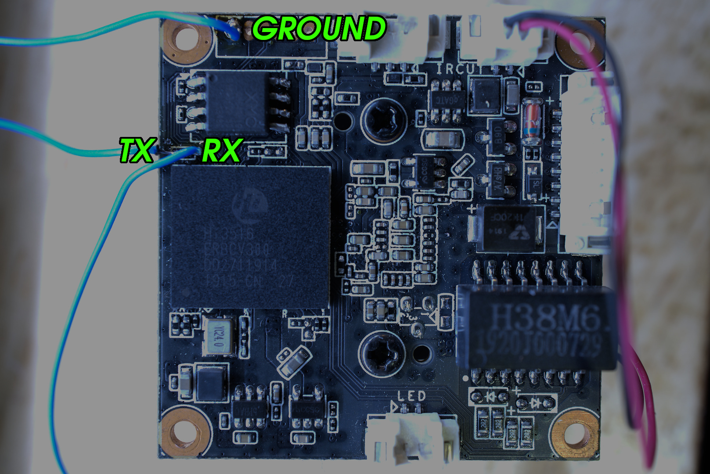

Configuration for OpenIPC for the Topsee Topsee_HI3516EV300_IMX335.



At this time the driver for the IMX335 distributed with OpenIPC does not work
with this device (https://github.com/OpenIPC/firmware/issues/563), however
through debugging a binary has been provided that works which is in this
repository. Hopefully this will be fixed upstream in short order.

Until this is fixed upstream it is recommended to place the file
`libsns_imx335_2l.so` into `/root` and use the configuration
`imx335_5M_topsee.ini` provided here.

This camera seems to be lacking an IR sensor, however here is the configuration
needed for Night Mode in Majestic:

```
.nightMode.irCutPin1: 30
.nightMode.irCutPin2: 31
.nightMode.backlightPin: 14
```
